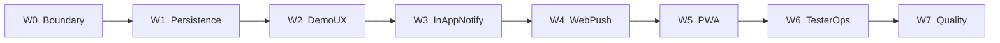

# 웹 고도화 (데모/프리뷰 + Web Push + PWA)

권위: [`decision-log.md`](./decision-log.md) · [`deploy-checklist.md`](./deploy-checklist.md) · [`AGENTS.md`](../AGENTS.md).  
실행 추적 ID: **N4-W0 … N4-W7** (`deploy-checklist.md` §N4-W).

## 0. 고정 결정 (2026-08-04 Master)

| # | 결정 | 상태 |
|---|------|------|
| 1 | 웹 = **데모/프리뷰 1차 표면** (`https://msn.iykyka.com`). Android 동등 교체 아님 | 확정 |
| 2 | **Web Push**(FCM Web + VAPID) · **PWA**(설치·standalone·셸 SW) 포함 | 확정 |
| 3 | 본 문서로 Wi를 **완전 상세**히 짜고, **Wi 단위**로 차근차근 구현 | 확정 |
| 4 | **Q9**(L2 수신 트리거 자동응대) · PoC §3 기본값 추측 · L3/OS/B2B **비범위** | 확정 |

### 성공 정의 (데모/프리뷰)

두 테스터가 **브라우저만**으로: 가입(또는 로그인) → 사용자 ID 교환·연락처 → 대화 → 초안(✨) → L1 승인·와카뷰 뱃지 → 설정/로그아웃까지 **안정 시연**.

### 비범위 (전체 공통)

- Q9 수신 트리거 자동응대 및 “자리를 비우면 알아서 답함” 카피
- 사람 PoC #1/#3 실행 · 자율성/화이트리스트 **기본값** 확정
- Android N4 실기기 트랙(병행 가능, 본 문서 작업 분해에 넣지 않음)
- Drift WASM / SQLCipher-on-web / Play·App Store 배포
- 계정 삭제 UI (Q8e), 이미지·읽음·타이핑 등 일반 메신저 확장

### 구현 규율

1. **한 번에 W 전체 구현 금지.** `Wi`마다 Master 승인 → 코드 → 본 문서·`deploy-checklist` Status 동시 갱신.
2. Wi 완료 전 다음 Wi 착수하지 않는다 (의존 화살표 준수). 예외는 Master 명시.
3. 시크릿(Firebase Web config, VAPID, 서비스 계정) **git 커밋 금지**.
4. 서버 FCM HTTP v1 SA는 Android N4와 **공유**. 클라이언트 시크릿 경로만 플랫폼별 분리.

---

## 1. As-is (코드 박제, 2026-08)

| 영역 | 현황 | 근거 |
|------|------|------|
| 서빙 | Flutter web + nginx, API/WS 프록시 | `mobile/Dockerfile`, `deploy/nginx-web.conf` |
| 로컬 DB | 웹 = **메모리 스텁**, 새로고침 시 말투·온보딩·스누즈 유실 | `mobile/lib/db/app_database_web.dart` |
| 세션 | `shared_preferences`에 user/token (웹에서도 대체로 유지) | `mobile/lib/state/session_state.dart` |
| 푸시 | 웹에서 FCM 즉시 skip → `install:` 플레이스홀더 | `mobile/lib/services/push_token_service.dart` |
| 스누즈 OS 알림 | 웹 no-op | `mobile/lib/services/snooze_notification_service_web.dart` |
| PWA 골격 | `manifest.json` + icons 있음. theme `#7C6FF0`(낡은 아우로라). SW 전략 미문서화 | `mobile/web/` |
| 서버 푸시 | HTTP v1 SA 마운트됨. 플레이스홀더 토큰은 skip | `core-backend/push.go`, `/admin/push-test` |
| 테마 | iMessage-inspired light + soft charcoal dark | `mobile/lib/theme/app_theme.dart` (`#007AFF` / canvas `#F2F2F7`·`#141418`) |

---

## N4-W0 — 제품 경계

| | |
|--|--|
| **Status** | **done** (본 문서 랜딩으로 경계 고정, 2026-08-04) |
| **목표** | 웹 고도화의 제품·기술 경계를 문서에 고정해 구현 범위 논쟁을 없앤다 |
| **비범위** | 코드 변경 없음 |

### 작업 분해

- [x] 데모/프리뷰 성공 정의 기록
- [x] Q9 / PoC §3 / Android N4 / Drift WASM 비범위 명시
- [x] Wi 순서·승인 규율 명시
- [x] README · roadmap · deploy-checklist · fcm-setup · mobile README 교차 링크

### 수락 기준

- [x] 본 파일 §0이 Master 결정 4항과 일치
- [x] 실행 ID N4-W*가 `deploy-checklist.md`에 존재

### Master 액션

- 없음 (문서 승인 = W0 완료)

### 위험

- “웹도 Android만큼”으로 범위가 커지면 W1에서 Drift WASM 등으로 비대화 → §0을 인용해 거절

### 터치 파일 (문서)

- `docs/web-upgrade.md` (본 파일)
- `README.md`, `docs/roadmap.md`, `docs/deploy-checklist.md`, `docs/fcm-setup.md`, `mobile/README.md`

---

## N4-W1 — 웹 로컬 지속성

| | |
|--|--|
| **Status** | todo (구현 전 · Master Wi 승인 후) |
| **목표** | 하드 리프레시 후에도 말투·온보딩·스누즈·install id가 유지되는 프리뷰 UX |
| **비범위** | SQLCipher/암호화 DB, Drift WASM, 서버 측 말투 동기화 |

### As-is

- `AppDatabase` 웹 구현이 in-memory `Map` (`app_database_web.dart`)
- 인증만 `SharedPreferences`에 남아 새로고침 후 “가입된 것처럼” 보이지만 말투 온보딩이 다시 뜰 수 있음

### To-be

- 웹 `AppDatabase`를 **durable KV**로 승격
- **기술 선택 (고정):** `shared_preferences`(또는 동일 idb 백엔드)로 KV·말투 JSON·스누즈 맵 직렬화. **Drift WASM 비채택**
- `encrypted` 플래그는 웹에서 계속 `false`; `DataFlowScreen` 카피에 “웹 프리뷰는 브라우저 저장소(비암호화)” 명시

### 작업 분해

- [ ] `app_database_web.dart`: open 시 prefs/idb 로드, mutate 시 persist
- [ ] 키 네임스페이스 고정 예: `ykavu_web_kv_*`, `ykavu_web_tone_samples`, `ykavu_web_snoozes_json`
- [ ] `SessionState.restore` 경로에서 웹도 동일 API로 말투/온보딩 복원되는지 확인
- [ ] 단위 테스트: 웹 stub에 fake prefs 주입해 round-trip (가능하면)
- [ ] `DataFlowScreen` / 테스터 카피 1줄 갱신

### 수락 기준

- [ ] Chrome에서 가입 → 말투 저장 → **하드 리프레시** → 온보딩 스킵·말투 유지
- [ ] 스누즈 설정 → 리프레시 → 목록 배지/채팅 배너 유지
- [ ] 시크릿 창(다른 프로필)과는 저장소 격리 (기대 동작으로 문서화)

### Master 액션

- 승인 후 구현 착수; 별도 시크릿 없음

### 위험

- prefs 용량·JSON 파싱 오류 시 빈 DB로 폴백 (corrupt 시 wipe + 로그)
- 여러 탭 동시 기록 → last-write-wins 허용 (프리뷰)

### 예상 터치 파일

- `mobile/lib/db/app_database_web.dart`
- `mobile/lib/screens/data_flow_screen.dart` (카피)
- `mobile/test/` (웹 persistence 테스트, 선택)
- `docs/web-upgrade.md` Status → done

---

## N4-W2 — 데모 메신저 UX

| | |
|--|--|
| **Status** | todo |
| **목표** | 데스크톱·모바일 브라우저에서 시연 마찰을 줄인 프리뷰 UX |
| **비범위** | 디자인 시스템 전면 교체, 카드/히어로 과설계, Q9 카피 |

### As-is

- 모바일 우선 단일 컬럼 스택; 대화 목록 ↔ 채팅 push
- `MyUserIdChip` 등 ID 노출은 있으나 페어링 CTA 발견성 편차
- WS 재연결 backoff는 구현됨, UI 인디케이터는 약함

### To-be

- **넓은 뷰포트(예: ≥900px):** 목록 | 채팅 **분할**(또는 동등 반응형). 좁은 폭은 기존 스택 유지
- WS 연결 상태: connecting / live / reconnecting(backoff) 한 줄 표시
- 내 사용자 ID **원탭 복사** CTA 강화 (대화 목록·설정)
- 웹 기대치 배너(첫 진입 또는 설정): 새로고침 후 데이터(W1 이후), 알림(W3/W4), 홈 화면 추가(W5)
- 시각: 기존 iMessage-inspired 테마 유지. 신규 카드 남발·히어로 오버레이 금지

### 작업 분해

- [ ] 반응형 셸 위젯 (목록+상세) — `main.dart` / conversation·chat 라우팅 정리
- [ ] `WsClient` 상태 → UI 바인딩
- [ ] ID 복사 SnackBar/토스트
- [ ] 웹 전용 1회 dismissible 안내
- [ ] 수동: 1280px·390px 폭 시연 시나리오

### 수락 기준

- [ ] 두 폭에서 가입→대화→초안 시연 가능
- [ ] 재연결 중 사용자가 “멈춤”으로 오해하지 않도록 상태 문구 노출
- [ ] 테마/브랜드 규칙 위반 없음 (기존 `AppTheme`)

### Master 액션

- UX 톤 승인 (분할 vs 스택-only 미세 조정은 구현 PR에서 스크린샷)

### 위험

- Navigator 스택과 분할 레이아웃 충돌 → 웹만 `MasterDetail` 패턴으로 격리

### 예상 터치 파일

- `mobile/lib/main.dart`
- `mobile/lib/screens/conversation_list_screen.dart`
- `mobile/lib/screens/chat_screen.dart`
- `mobile/lib/services/ws_client.dart` (상태 노출 API)
- `mobile/lib/widgets/my_user_id_chip.dart` (또는 설정)

---

## N4-W3 — 인앱·브라우저 알림 대체 (Push 전)

| | |
|--|--|
| **Status** | todo |
| **목표** | 웹에서 스누즈/에스컬레이션을 OS 로컬알림 없이 **인지 가능**하게 |
| **비범위** | FCM Web Push 본구현(W4), Android `flutter_local_notifications` 변경 |

### As-is

- `snooze_notification_service_web.dart` = no-op
- 인앱 배지/배너(C6c)는 동작 (포그라운드·리프레시 후 W1 전제)

### To-be (고정 우선순위)

1. **항상:** 인앱 배지·배너·Inbox (기존)
2. **권한 허용 시:** 브라우저 **Notification API**로 스누즈 마감·(선택) 포그라운드 에스컬레이션 토스트성 알림
3. 권한 거부/미지원: 인앱만 — 실패로 치지 않음

스케줄: 웹은 Service Worker 알람이 약하므로 **포그라운드 타이머 + 다음 포커스 시 past-due 검사**를 1차 경로로 한다. (백그라운드 확정 전달은 W4)

### 작업 분해

- [ ] `snooze_notification_service_web.dart`: Notification API 래퍼 + permission 요청 UX
- [ ] 앱 포그라운드/visibility 복귀 시 `isSnoozePastDue` 일괄 검사 → 배너/Notification
- [ ] 에스컬레이션 수신 시 포그라운드 SnackBar/배지 (WS 이벤트 훅)
- [ ] 설정 화면에 “브라우저 알림” 토글/상태 (선택)

### 수락 기준

- [ ] 권한 허용 + 탭 포커스 상황에서 스누즈 마감 인지 가능
- [ ] 권한 거부 시에도 인앱 배지로 동일 정보
- [ ] W4 없이도 데모 스크립트에 “알림 허용” 선택 단계로 설명 가능

### Master 액션

- 브라우저에서 알림 허용 클릭 (시연 시)

### 위험

- Safari/iOS 웹 알림 제약 → Chrome/Desktop을 데모 기준 브라우저로 명시 (W6)

### 예상 터치 파일

- `mobile/lib/services/snooze_notification_service_web.dart`
- `mobile/lib/services/snooze_controller.dart`
- `mobile/lib/screens/chat_screen.dart` / `conversation_list_screen.dart`
- `mobile/lib/screens/settings_screen.dart` (선택)

---

## N4-W4 — Web Push (FCM)

| | |
|--|--|
| **Status** | todo (Master Firebase Web 설정 의존) |
| **목표** | 웹 탭이 백그라운드여도 에스컬레이션 등 서버 `notifyUser`가 **실 FCM 웹 토큰**으로 전달 |
| **비범위** | 레거시 `FCM_SERVER_KEY` 신규 의존, 커스텀 푸시 프로토콜 |

### As-is

- `_tryFirebaseToken()`이 `kIsWeb`이면 즉시 `null`
- DB device_tokens는 `install:…` / `platform=web`만 → `only_placeholder_tokens`

### To-be

- Firebase **Web** 앱 + Messaging + **VAPID 키**
- `Firebase.initializeApp(options: …)` + `FirebaseMessaging.instance.getToken(vapidKey: …)`
- 성공 시 `platform=web` **실토큰** 등록 (서버 v1 전송 경로 재사용)
- 실패 시 기존처럼 `install:` soft-fallback (앱 기동 막지 않음)

### Master 액션 (블로커)

1. Firebase Console에 Web 앱 추가 (`msn.iykyka.com`)
2. Cloud Messaging Web Push 인증서/VAPID 키 발급
3. Web config (`apiKey`, `authDomain`, `projectId`, `messagingSenderId`, `appId`, `vapidKey`)를 **빌드 시크릿**으로 전달 (git 금지)
4. (권장) `firebase-messaging-sw.js` 요구사항 확인 — FlutterFire 문서에 맞게 `web/`에 스켈레톤

### 작업 분해

- [ ] 빌드 주입 방식 확정: `--dart-define=FIREBASE_…` 및/또는 생성 `firebase_options_web.dart` (gitignore)
- [ ] `PushTokenService._tryFirebaseToken` 웹 분기 구현 + permission
- [ ] Docker web 빌드에 define 전달 (`mobile/Dockerfile` / compose)
- [ ] `/admin/push-test`로 user 지정 → Chrome 백그라운드 수신
- [ ] `docs/fcm-setup.md` Web 절을 본 W4와 동기화
- [ ] `DataFlowScreen` 푸시 문구 갱신

### 수락 기준

- [ ] device_tokens에 `install:`이 아닌 토큰 + `platform=web`
- [ ] `POST /admin/push-test` → `sent >= 1`, 브라우저 알림 표시
- [ ] 시크릿이 git history에 없음

### 위험

- SW 등록 순서/캐시로 토큰 null → 배포 후 hard refresh 절차를 W6에 적음
- Android `google-services.json`과 Web config 혼동 → 문서에서 경로 분리

### 예상 터치 파일

- `mobile/lib/services/push_token_service.dart`
- `mobile/web/` (messaging SW, index 훅)
- `mobile/Dockerfile` / `.env.example` (define 이름만)
- `docs/fcm-setup.md`, `docs/web-upgrade.md`

### 서버

- **코드 변경 최소.** 기존 `notifyUser` / HTTP v1. 웹 토큰도 동일 messages:send

---

## N4-W5 — PWA

| | |
|--|--|
| **Status** | todo |
| **목표** | 홈 화면 추가·standalone으로 데모 가능; 오프라인은 **셸만** |
| **비범위** | 오프라인 메시지 작성/전송, 풀 오프라인 메신저 |

### As-is

- `mobile/web/manifest.json`: name/icons/`display:standalone` 있음
- `theme_color` / `background_color` = `#7C6FF0` (현 테마와 불일치)
- `index.html` description = 플레이스홀더 (“A new Flutter project.”)
- Flutter 빌드가 `flutter_service_worker.js` 생성 가능 — 운영 캐시 버스트 미문서화

### To-be

| 항목 | 값 |
|------|-----|
| theme / background | light canvas `#F2F2F7` 또는 accent `#007AFF` (택1, 구현 시 `AppTheme`와 맞춤) |
| description | 제품 한 줄: “나를 대신해 답하는, 나만의 와카뷰” |
| 오프라인 | 앱 셸 캐시만. API/WS는 온라인 필수 — 오프라인 시 명확한 배너(W2와 공유) |
| install | Chrome installability (manifest + SW + HTTPS + icons) |

### 작업 분해

- [ ] `manifest.json` 색·description·`orientation` 재검토 (데모는 portrait+landscape 허용 검토)
- [ ] `index.html` meta / apple-touch / title 정리
- [ ] 배포 후 SW 캐시로 구버전 고착 시: nginx/`Cache-Control` · Flutter 버전 해시 절차를 ops에 한 절
- [ ] (선택) 인앱 “홈 화면에 추가” 안내 (beforeinstallprompt는 브라우저별)

### 수락 기준

- [ ] Chrome Lighthouse/Application 패널에서 manifest 오류 없음
- [ ] standalone 창에서 로그인 세션·채팅 시연 가능
- [ ] 네트워크 오프라인 시 “연결 필요” 인지 (조용한 실패 금지)

### Master 액션

- 배포 파이프라인에 Web Firebase define이 있으면 W4와 동일 시크릿 유지
- 컷오버 후 한 번 hard refresh / “Unregister SW” 런북 숙지

### 위험

- SW가 오래된 main.dart.js 제공 → 배포 체크리스트에 “웹 캐시 확인” 항목

### 예상 터치 파일

- `mobile/web/manifest.json`
- `mobile/web/index.html`
- `deploy/nginx-web.conf` (캐시 헤더, 필요 시)
- `docs/deploy-checklist.md` / `docs/tester-guide.md`

---

## N4-W6 — 테스터 운영 폴리시

| | |
|--|--|
| **Status** | todo |
| **목표** | 웹 데모 스크립트가 설치·알림·페어링·로그아웃까지 재현 가능 |
| **비범위** | PoC 인터뷰 본실행, SHARE_URL(별도 N4-13) |

### 작업 분해

- [ ] [`tester-guide.md`](./tester-guide.md)에 절 추가:
  - 권장 브라우저: **Desktop Chrome**
  - 시크릿/다른 프로필 두 명 페어링
  - 알림 허용 (W3/W4)
  - PWA 설치 (W5)
  - 설정 → 로그아웃 → 「이미 가입」 재로그인 (Q8)
- [ ] 데모 실패 시 런북: SW unregister, prefs 클리어, `/admin/push-test` 해석

### 수락 기준

- [ ] 신규 테스터가 가이드만으로 페어링·초안 시연 가능 (Master 또는 대리 1회 walkthrough)

### Master 액션

- 가이드 문구 톤 확인

### 예상 터치 파일

- `docs/tester-guide.md`
- `docs/web-upgrade.md`

---

## N4-W7 — 품질

| | |
|--|--|
| **Status** | todo |
| **목표** | 웹 회귀를 자동화·수동 체크리스트로 고정 |
| **비범위** | Android 에뮬레이터 UI 탭(N4-5~10), Q9 테스트 |

### 작업 분해

- [ ] Playwright(또는 동등) 스모크 스크립트 위치 예: `scripts/e2e_web_smoke.py` / `mobile/test_driver/` — **한 도구로 고정**해 구현 시 선택
  - 커버: 입장 탭(가입/로그인) 렌더 · (가능 시) DEMO 로그인 · 대화 목록 셸 · 설정 진입
- [ ] 부록 수동 QA (아래 §부록 A) 실행 기록란
- [ ] CI 연동은 선택(시크릿·라이브 의존) — 로컬/`msn` 수동 실행을 1차로

### 수락 기준

- [ ] 스모크가 문서화된 명령 한 줄로 실행됨
- [ ] W1~W5 수락 기준이 부록 체크와 연결됨

### Master 액션

- 라이브 대상 스모크 시 DEMO 계정 충돌 주의 (display_name)

### 예상 터치 파일

- `scripts/` 또는 `mobile/integration_test/`
- `docs/web-upgrade.md` 부록

---

## 2. Android N4와의 관계

| 항목 | Android N4 | Web N4-W |
|------|------------|----------|
| 서버 SA | 공유 (이미 배치된 경우 유지) | 동일 |
| 클라이언트 설정 | `google-services.json` | Firebase Web config + VAPID |
| 푸시 스모크 | 실기기 | Chrome + `/admin/push-test` |
| 로컬 DB | SQLCipher | prefs/idb (비암호화 프리뷰) |
| 일정 | Master 실기기 가능 시 | **문서 승인 후 웹 Wi 우선 가능** |

병행 시 서버·compose 충돌 최소화: web 이미지 빌드 args만 추가.

---

## 3. 상태 갱신 규칙

Wi를 끝낼 때마다:

1. 본 문서 해당 Wi **Status** → `done` (또는 `done (부분)`) + 날짜
2. [`deploy-checklist.md`](./deploy-checklist.md) N4-W 표 Status 동기화
3. [`roadmap.md`](./roadmap.md) Web `[~]` 체크 갱신
4. 구현 커밋과 **같은 변경**에 문서 체크를 넣음 (허위 done 금지)

---

## 부록 A — 웹 수동 QA 체크리스트 (구현 후)

**환경:** Desktop Chrome · `https://msn.iykyka.com` · 필요 시 시크릿 창 2개

| # | 단계 | W 의존 | OK |
|---|------|--------|-----|
| A1 | 새로 가입 (DEMO) + 말투 저장 | W1 | [ ] |
| A2 | 하드 리프레시 후 세션·말투 유지 | W1 | [ ] |
| A3 | 두 프로필 페어링 · 메시지 · 초안 · 뱃지 | W2 | [ ] |
| A4 | WS 끊김/재연결 상태 인지 | W2 | [ ] |
| A5 | 스누즈 → 인앱 배지 (+ 알림 허용 시 Notification) | W3 | [ ] |
| A6 | 설정 → 로그아웃 → 이미 가입 로그인 | Q8 | [ ] |
| A7 | 실 FCM 웹 토큰 · push-test 수신 | W4 | [ ] |
| A8 | PWA 설치 · standalone 시연 | W5 | [ ] |
| A9 | 오프라인 시 연결 필요 안내 | W5 | [ ] |

---

## 부록 B — Master 시크릿 체크리스트 (W4)

- [ ] Firebase Web app 등록 (도메인 `msn.iykyka.com`)
- [ ] VAPID key
- [ ] 빌드 환경에 define/options 주입 (git 미포함)
- [ ] 서버 `secrets/firebase-service-account.json` 유지 (Android와 공유)
- [ ] push-test로 `sent >= 1` 확인

---

## 부록 C — 관련 문서

| 문서 | 관계 |
|------|------|
| [`deploy-checklist.md`](./deploy-checklist.md) | N4-W 실행 표 |
| [`fcm-setup.md`](./fcm-setup.md) | Android + Web 시크릿 절차 |
| [`tester-guide.md`](./tester-guide.md) | 테스터 스크립트 (W6) |
| [`account-settings-ia.md`](./account-settings-ia.md) | Q8 완료 · Q9 비범위 |
| [`roadmap.md`](./roadmap.md) | Phase 체크 |
| [`android-release.md`](./android-release.md) | 별트랙 (본 문서 비범위) |
